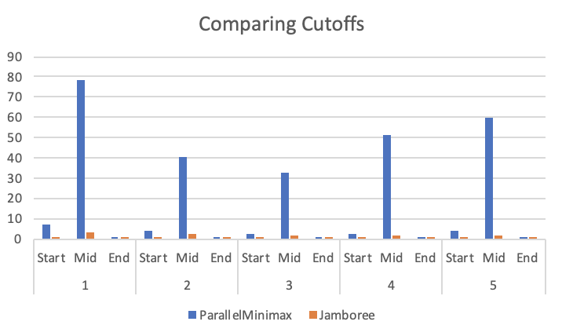
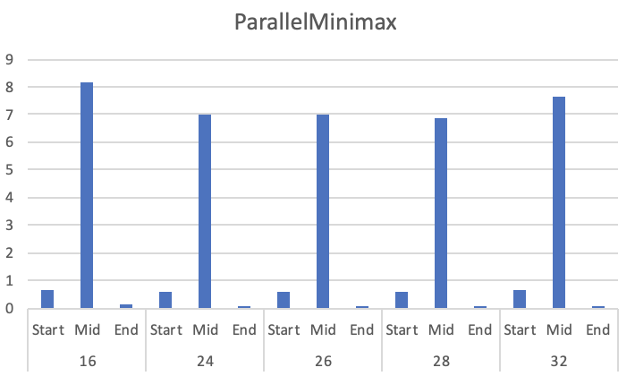
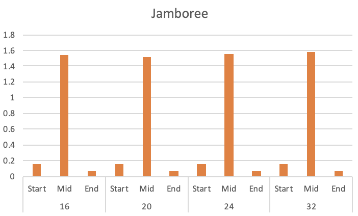
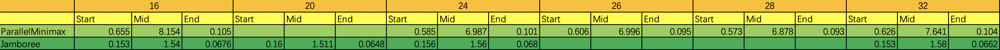
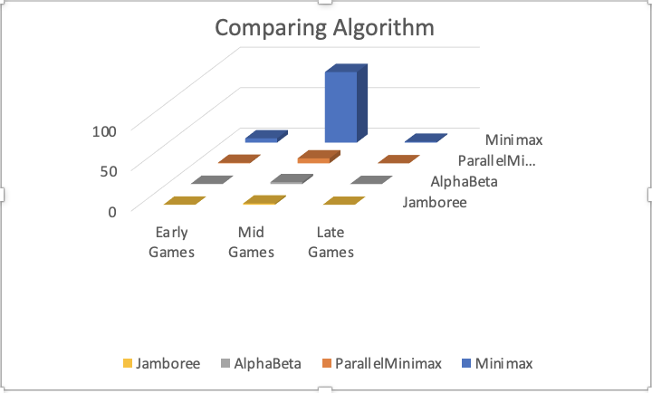

# Project 3 (Chess) Write-Up #
--------

## Project Enjoyment ##
- How Was Your Partnership?
  <pre>Fantasic</pre>
  
- What was your favorite part of the project?
  <pre>Optimizing algorithm</pre>

- What was your least favorite part of the project?
  <pre>Debugging parallel code</pre>

- How could the project be improved?
  <pre>Maybe provide some pseudo code of optimizing algorithms</pre>

- Did you enjoy the project?
  <pre>Of course.</pre>
    
-----

## The Chess Server ##
- When you faced Clamps, what did the code you used do?  Was it just your jamboree?  Did you do something fancier?
  <pre>Jamboree with sorting</pre>

- Did you enjoy watching your bot play on the server?  Is your bot better at chess than you are?
  <pre>Yes for both. Since I know nothing of chess.</pre>

- Did your bot compete with anyone else in the class?  Did you win?
  <pre>No.</pre>

- Did you do any Above and Beyond?  Describe exactly what you implemented.
  <pre>No.</pre>

## Experiments ##
**NOTE**: Feel free to tweak your divide cutoff variable to beat clamps, **but keep it constant for your experiments.**

### Chess Game ###

#### Hypotheses ####
Suppose your bot goes 3-ply deep.  How many game tree nodes do you think
it explores (we're looking for an order of magnitude) if:
 - ...you're using minimax?
    <pre>10^4</pre>
 - ...you're using alphabeta?
    <pre>10^3</pre>

#### Results ####
Run an experiment to determine the actual answers for the above.  To run
the experiment, do the following:
1. Run SimpleSearcher against AlphaBetaSearcher and capture the board
   states (fens) during the game.  To do this, you'll want to use code
   similar to the code in the testing folder.
2. Now that you have a list of fens, you can run each bot on each of them
   sequentially.  You'll want to slightly edit your algorithm to record the
   number of nodes you visit along the way.
3. Run the same experiment for 1, 2, 3, 4, and 5 ply. And with all four
   implementations (use ply/2 for the cut-off for the parallel
   implementations). Make a pretty graph of your results and fill in the table 
   here as well. NOTE: Your result should be the average number of nodes visited
   across all fens for each bot & depth.

<pre>TODO: Fill in the table below</pre>


|      Algorithm     | 1-ply | 2-ply | 3-ply | 4-ply | 5-ply |
| :----------------: |:-----:|:-----:|:-----:|:-----:|:-----:|
|       Minimax      |   26    |  889    |   28699   |  998573   |  33739247    |
|  Parallel Minimax  |   26   |   889   |    28699   |   998573    |   33739247  |
|      Alphabeta     |  26   |   345   |    5947     |   61921    |   627078  |
|      Jamboree      |   26   |   348   |   6572    |  75452   |   732014    |

#### Conclusions ####
How close were your estimates to the actual values?  Did you find any
entry in the table surprising?  Based ONLY on this table, do you feel
like there is a substantial difference between the four algorithms?
<pre>1. The results we got with averaging 12 trails starting from different board positions in the game are pretty close to our estimation in order of magnitude. For ply = 3, we are estimating minimax to explore 35^3 nodes which is 10^4 in order of magnitude and alphabeta about one order less which is 10^3 and the result come out to have the same order of magnitude. 2.We are a little bit surprised by the result that Jamboree check more nodes than Alphabeta 3. Only basing on the table, there is no difference between Minimax and Parallel Minimax while Alphabeta and Jamboree check much fewer nodes in each ply.</pre>

### Optimizing Experiments ###
**THE EXPERIMENTS IN THIS SECTION WILL TAKE A LONG TIME TO RUN.**
To make this better, you should use Google Compute Engine:
* Google Compute Engine lets you spin up multiple instances. You should do this to run multiple experiments in parallel.
* **DO NOT** run multiple experiments in parallel on the same machine. This will lead to strange results.
* It's not strictly required to run experiments on multiple machines, but the write-up will take a lot longer if you don't do this.

#### Generating A Sample Of Games ####
Because chess games are very different at the beginning, middle,
and end, you should choose the starting board, a board around the middle
of a game, and a board about 5 moves from the end of the game.  The exact boards
you choose don't matter (although, you shouldn't choose a board already in
checkmate), but they should be different.

#### Sequential Cut-Offs ####
Experimentally determine the best sequential cut-off for both of your
parallel searchers.  You should test this at depth 5.  If you want it
to go more quickly, now is a good time to figure out Google Compute
Engine.   Plot your results and discuss which cut-offs work the best on each of
your three boards.
<pre>We get the following result by running 5 trials on each board state with each cutoff and get the average of the 5 timing results. We test the time performing task cost on cutoff 1 to 5 and found out that for all 3 board states, both the algorithms perform  best with cutoff 3. The following is our data and graph made from the data we got. </pre>



#### Number Of Processors ####
Now that you have found an optimal cut-off, you should find the optimal
number of processors. You MUST use Google Compute Engine for this
experiment. For the same three boards that you used in the previous 
experiment, at the same depth 5, using your optimal cut-offs, test Parallel Minimax and
Jamboree on a varying number of processors.  You shouldn't need to test all 32
options; instead, do a binary search to find the best number. You can tell the 
ForkJoin framework to only use k processors by giving an argument when
constructing the pool, e.g.,
```java
ForkJoinPool POOL = new ForkJoinPool(k);
```
Plot your results and discuss which number of processors works the best on each
of the three boards.
<pre>We set the cutoff to be 3, and for each constant k, we run five trials on each board state on each algorithm and calculate the average to get the following result. As the time cost on early and late states is very short comparing to the time spend on middle state, we think that the performance of the algorithms is reflected by the time spend on the middle state. For both the algorithms, we test the time on 32 cores and then 16 cores. We found that 32 cores are performing better than 16 cores, so we test on the middle of 32 and 16 which is 24 cores. And we continue this process and found out that parallel minimax has the best performance with 20 cores and Jamboree has the best performance with 28 cores. </pre>





#### Comparing The Algorithms ####
Now that you have found an optimal cut-off and an optimal number of processors, 
you should compare the actual run times of your four implementations. You MUST
use Google Compute Engine for this experiment (Remember: when calculating
runtimes using *timing*, the machine matters).  At depth 5, using your optimal 
cut-offs and the optimal number of processors, time all four of your algorithms
for each of the three boards.

Plot your results and discuss anything surprising about your results here.
<pre>By using the best performance parameters for parallel minimad and Jamboree we get the following result by running 5 trials on each board state in each algorithm and get the average of the 5 timing results. From our graph we can see that the performances of algorithms differs greatly. The time spend on each board state is Minimax, Parallel Minimax, Alphabeta and Jamboree from longest to shortest. We can see parallel algorithms are faster than similar algorithms without using parallel and algorithms using alpahbeta pruning are faster than algorithms not using it. </pre>

|      Algorithm     | Early Game | Mid Game | End Game |
| :----------------: |:----------:|:--------:|:--------:|
|       Minimax      |   5.31   |   87.16     |    1.11      |
|  Parallel Minimax  |    0.71     |   6.17   |    0.083    |
|      Alphabeta     |  0.21   |   2.43   |    0.095      |
|      Jamboree      |   0.16  |   1.56    |     0.067      |




### Beating Traffic ###
In the last part of the project, you made a very small modification to your bot
to solve a new problem.  We'd like you to think a bit more about the 
formalization of the traffic problem as a graph in this question.  
- To use Minimax to solve this problem, we had to represent it as a game. In
  particular, the "states" of the game were "stretches of road" and the valid
  moves were choices of other adjacent "stretches of road".  The traffic and
  distance were factored in using the evaluation function.  If you wanted to use
  Dijkstra's Algorithm to solve this problem instead of Minimax, how would you
  formulate it as a graph?
  <pre>For Dijkstra’s algorithm, we see each location as vertex and the path connecting each location as an edge. Weight the edge with the length of the path or the length of the path divided by the limited speed to get the time spend on that path. Dijkstra’s then can find the path with the shortest distance if we weight each edge by its length, or find the path with the shortest time if we weight each edge with the time it cost to past the path.</pre>

- These two algorithms DO NOT optimize for the same thing.  (If they did,
  Dijkstra's is always faster; so, there would be no reason to ever use
  Minimax.)  Describe the difference in what each of the algorithms is
  optimizing for.  When will they output different paths?
  <pre>Dijkstra’s always finds the path with the shortest distance or costing the shortest time without considering traffic, also it does not has a limit on time. Minimax always find a path costing time in traffic within the limited time threshold. The output will be different for 2 algorithms when the time cost by the path is larger than the time threshold set in minimax algorithm. In that case, Dijkstra’s will return a normal value while Minimax will return a  very negative value to indicate that the time the path cost is over limit.</pre>

